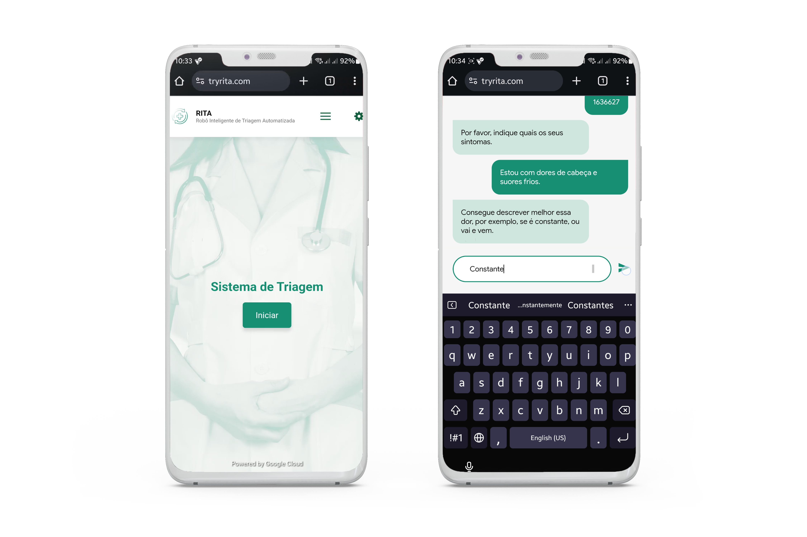

# RITA – Robô Inteligente de Triagem Automatizada

_Project developed in the context of Google Cloud Day Lisbon Hackathon: Leveraging AI for Portugal. Six teams have participated, and a different challenge was given to each of them. Ours was tasked with creating a smart triage agent using Google Cloud products._
___

### Table of contents
[Description](#description) · [Features](#features) · [Benefits & Impact](#benefits--impact) · [Next steps](#next-steps) · [Future features](#future-features) · [Credits](#credits)

___

 

## Description

RITA – Robô Inteligente de Triagem Automatizada [Smart Robot for Automated Triage] is a smart triage agent based on the Manchester Triage System that is able to take natural language input (text or voice) and classify the priority of patient treatment, based on the described symptoms.

Designed to streamline the triage process in healthcare settings, this project was developed during a hackathon to address the pressing issue of long wait times and overcrowding in emergency services. By combining AI with clinical expertise, RITA provides an efficient triage process, reducing the workload of healthcare professionals.

 

  
  

<i>Demo screenshots. <a href="./demo_recording_desktop.mp4">Watch recorded desktop demo.</a></i>

 

## Features
- **`Natural Language Input`**: _Supports both text and speech for seamless interaction._
- **`Real-Time Triage`**: _Helps patients triage themselves before arriving at the emergency department, reducing non-emergent visits._
- **`Integration with Hospital Systems`**: _Can be connected with electronic health records (EHR) and updates the patient’s status in the hospital system._
- **`AI-Driven Triage`**: _Leverages the Manchester Triage System to classify patients into different urgency levels, ensuring appropriate care._
- **`Cloud-Based`**: _Uses Google infrastructure for scalability, security, and updates._

 

<i>Solution flowchart.</i>

 
  
## Benefits & Impact

| Social |
|--|
| • **`No Call Queue`**: _Unlike traditional emergency services or hotlines, RITA eliminates the need for waiting in call queues._   • **`Shorter On-Site Wait Times`**: _By triaging before arrival, patients can be seen faster._   • **`Relieves Healthcare Staff`**: _Allows professionals to focus on urgent cases by reducing the non-emergent patient influx._ |

 

| Technical |
| -- |
| • **`Managed Infrastructure`**: _Google ensures the system’s security, scalability, and regular updates._   • **`Interoperability`**: _RITA can be integrated with other virtual and human agents, as well as hospital EHR systems._   • **`Continuous Improvement`**: Machine learning continuously enhances the accuracy of the triage process. |

 

___

 

## Next Steps
1. **`Development`**: _Refine the triage dialogue flow in collaboration with medical professionals and ethicists._
2. **`Data Collection`**: _Improve access to quality data and validate user inputs._
3. **`Integration`**: _Seamlessly integrate patient medical history and status updates into hospital systems._
4. **`Multilingual Support`**: _Eliminates language barriers by offering multiple languages._

 

## Future Features
- **`Monitor Physiological Factors`**: _Track real-time health data._
- **`Observe Symptoms`**: _Allow the system to use AI and smartphone camera for visible symptom identification._
- **`Service Suggestions`**: _Recommend nearby services based on distance and wait time._

 

[To know more about this project, check our pitch slideshow.](./pitch_slideshow_static.pdf)

___

 

### Credits
Jorge Costa [@kelho0812](https://github.com/kelho0812/)

Jorge Cruz [@mjorgecruz](https://github.com/mjorgecruz)

Luís Carvalho [@luis-ffe](https://github.com/luis-ffe)

Rui Pires [@Rui-Pedro-Pires](https://github.com/Rui-Pedro-Pires)

Teresa Chow (me)

> _And a special thanks to Frederico Carvalho, our mentor throughout this challenge, for his continued support._

 

[⬆ back to top](#rita--rob%C3%B4-inteligente-de-triagem-automatizada)
